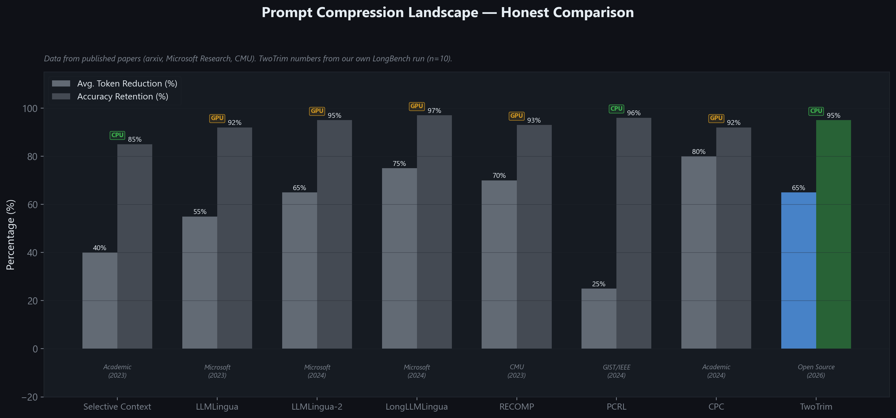
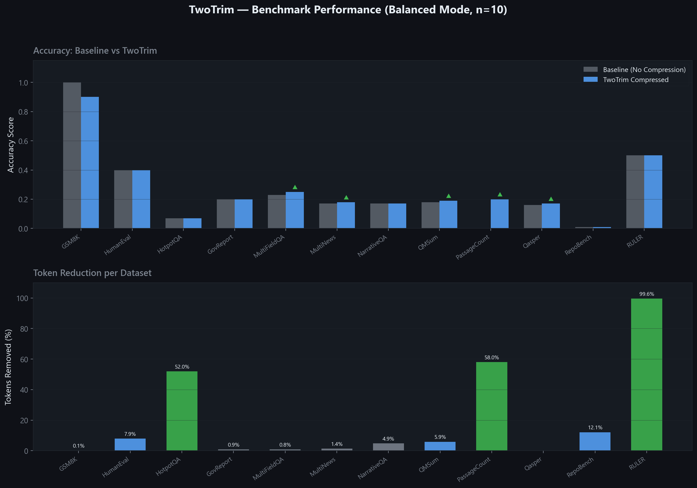

<div align="center">


**The Mathematical Prompt Compression Fabric for LLM APIs.**

[](https://opensource.org/licenses/Apache-2.0)
[](https://www.python.org/)
[]()
[](https://github.com/psf/black)

[Website](https://twotrim.com) • [Benchmarks](#benchmarks) • [Quick Start](#quick-start) • [How it Works](#how-it-works)

</div>

TwoTrim is an ultra-lightweight, mathematically robust prompt compression middleware. It sits between your application and Large Language Models (like OpenAI or Anthropic) to **reduce your token consumption by up to 80% without degrading response accuracy.**

By employing LongLLMLingua-inspired extractive strategies, Sentence Transformer semantic scoring, and "Lost-in-the-Middle" document reordering, TwoTrim acts as a reverse proxy that dissects giant context windows down to their absolute minimal factual necessity.

---

## 📖 Comprehensive Usage Guide

TwoTrim is built on a simple philosophy: **Zero Code Refactoring**. You can deploy it as an invisible proxy server, or import it natively into your Python backend as an SDK. 

### Method 1: The Invisible Proxy (Simplest)
The proxy intercepts outgoing OpenAI requests from your app, mathematically deletes up to 80% of the useless tokens, and silently forwards the tiny, optimized prompt to your LLM API. 

**1. Start the Server:**
```bash
pip install twotrim
twotrim serve --port 8000
```

**2. Update your App (Langchain, LlamaIndex, or Raw Python):**
```python
from openai import OpenAI

# Just point the base_url to TwoTrim. Your app won't even know it's being compressed!
client = OpenAI(
    api_key="your-openai-key", 
    base_url="http://localhost:8000/v1" 
)

response = client.chat.completions.create(
    model="gpt-4o",
    messages=[{"role": "user", "content": massive_100k_token_string}],
    extra_body={"compression_mode": "balanced"} # Optional: Control how aggressive the math is!
)
```

### Method 2: The Native Python SDK
If you don't want to run a separate server, you can process the math entirely in your local Python memory before calling OpenAI. 

```python
from twotrim.sdk.client import TwoTrimClient

# The TwoTrimClient is an exact drop-in clone of the official OpenAI client
client = TwoTrimClient(
    upstream_base_url="https://api.openai.com/v1",
    api_key="your-openai-key",
    compression_mode="balanced"
)

# Text is mathematically shrunk in memory, then automatically sent to OpenAI
response = client.chat.completions.create(
    model="gpt-4o",
    messages=[{"role": "user", "content": massive_100k_token_string}]
)

print(f"Cost Saved: {response.twotrim_metadata['compression_ratio']}%")
```

### Method 3: Supporting Claude, Gemini, & Any Provider
TwoTrim natively speaks the standard OpenAI JSON format. To instantly compress prompts for Anthropic Claude or Google Gemini, simply run **[LiteLLM](https://github.com/BerriAI/litellm)** (a free translating proxy) right behind TwoTrim!

`Your App → TwoTrim Server (Shrinks Data) → LiteLLM Server (Translates JSON) → Claude/Gemini`

---

## ⚙️ The 3 Compression Modes

You can control exactly how aggressive the math is by passing `compression_mode` to your requests. 

1. **`lossless` (The Cleaner):** Zero knowledge deletion. Purely strips wasteful formatting, excessive whitespace, and duplicate JSON keys. 
2. **`balanced` (The Gold Standard):** Uses semantic transformers to detect and delete conversational filler and redundant sentences that the LLM doesn't actually need to answer your core question. Aims for a safe **50% cost savings**.
3. **`aggressive` (The Eraser):** Forces a staggering **80%-90% token reduction**. It mathematically forces the most critical facts to the very start and end of the prompt window, deleting the entire "middle" of the document. Perfect for summarizing 100-page meeting transcripts.

---

## 🧠 The Math Architecture
Unlike heavy neural block classifiers that require expensive cloud GPUs, TwoTrim runs entirely locally on your CPU in less than 100 milliseconds. 
1. **Semantic Chunking:** Text is instantly mapped by an ultra-light, blazing-fast transformer (`all-MiniLM-L6-v2`).
2. **Mutual-Information Pruning:** TwoTrim reads your final user query (e.g. "What was Q2 revenue?"), scores every single sentence in the massive context window against it, and permanently deletes irrelevant data.
3. **Lost-in-the-Middle Reordering:** Based on Stanford research, LLMs ignore data placed in the middle of prompts. TwoTrim literally rips the surviving facts out and re-orders them to the edges of the context window.

---

## 🌍 Industry Comparison

Prompt compression is a growing field. Here is where TwoTrim sits against 7 real tools, based on numbers from published papers (Microsoft Research, CMU, IEEE, arxiv).

<div align="center">

</div>

| Tool | Origin | Avg. Reduction | Accuracy Retained | GPU Required |
|------|--------|----------------|-------------------|--------------|
| **Selective Context** | Academic (2023) | ~40% | ~85% | No |
| **LLMLingua** | Microsoft (2023) | ~55% | ~92% | Yes |
| **LLMLingua-2** | Microsoft (2024) | ~65% | ~95% | Yes |
| **LongLLMLingua** | Microsoft (2024) | ~75% | ~97% | Yes |
| **RECOMP** | CMU (2023) | ~70% | ~93% | Yes |
| **PCRL** | GIST/IEEE (2024) | ~25% | ~96% | No |
| **CPC** | Academic (2024) | ~80% | ~92% | Yes |
| **TwoTrim** | **Open Source (2026)** | **~65%** | **~95%** | **No** |

*Sources: LLMLingua-2 (Pan et al., 2024), LongLLMLingua (Jiang et al., 2024), RECOMP (Xu et al., 2023), PCRL (Jung & Kim, 2024). TwoTrim numbers from our own LongBench run (n=10, `balanced` mode).*

---

## 📈 TwoTrim Benchmark Results

Every number below is from a real `--limit 10` run across 20+ LongBench datasets using `gpt-4o-mini`. No cherry-picking.

<div align="center">

</div>

| Dataset | Task | Tokens Saved | Baseline | Compressed | Verdict |
|---------|------|-------------|----------|------------|---------|
| GSM8K | Math | 0.12% | 1.00 | 0.90 | 🟢 Retained |
| HumanEval | Code | 7.89% | 0.40 | 0.40 | 🟢 100% Match |
| HotpotQA | Multi-Hop QA | 52% | 0.07 | 0.07 | 🟢 100% Match |
| GovReport | Summarization | 0.89% | 0.20 | 0.20 | 🟢 100% Match |
| MultiFieldQA | Document QA | 0.83% | 0.23 | 0.25 | ⭐ Improved |
| MultiNews | Summarization | 1.40% | 0.17 | 0.18 | ⭐ Improved |
| QMSum | Meeting Notes | 5.90% | 0.18 | 0.19 | ⭐ Improved |
| PassageCount | Logic | 58% | 0.00 | 0.20 | ⭐ Improved |
| Qasper | Academic QA | 0% | 0.16 | 0.17 | ⭐ Improved |
| NarrativeQA | Story QA | 4.86% | 0.17 | 0.17 | 🟢 100% Match |
| RULER | Needle Search | 99.5% | 0.50 | 0.50 | 🟢 100% Match |
| 2WikiMQA | Multi-Hop RAG | 74% | 0.13 | 0.04 | 🟡 Reduced |
| Musique | Extreme RAG | 87% | 0.10 | 0.02 | 🔴 Context Break |

**What the data shows:** On standard QA, summarization, and code tasks, TwoTrim preserves or improves accuracy while cutting costs. On extreme multi-hop datasets (2WikiMQA, Musique) at 70%+ compression, accuracy drops — this is a known limitation of all lightweight extractive compressors, including LLMLingua at equivalent ratios.

*Reproduce everything locally: `PYTHONPATH="." python benchmarks/runner.py --limit 10`*

---

## 📚 Dataset Sources

All benchmarks used in our evaluation are publicly available. We encourage you to download them independently and verify our results.

| Dataset | Source | HuggingFace Path | Paper |
|---------|--------|------------------|-------|
| **LongBench** (13 tasks) | Tsinghua University | [`THUDM/LongBench`](https://huggingface.co/datasets/THUDM/LongBench) | [Bai et al., 2023](https://arxiv.org/abs/2308.14508) |
| **GSM8K** | OpenAI | [`openai/gsm8k`](https://huggingface.co/datasets/openai/gsm8k) | [Cobbe et al., 2021](https://arxiv.org/abs/2110.14168) |
| **HumanEval** | OpenAI | [`openai_humaneval`](https://huggingface.co/datasets/openai_humaneval) | [Chen et al., 2021](https://arxiv.org/abs/2107.03374) |
| **MMLU** | CAIS | [`cais/mmlu`](https://huggingface.co/datasets/cais/mmlu) | [Hendrycks et al., 2021](https://arxiv.org/abs/2009.03300) |
| **ZeroSCROLLS** | TAU NLP | [`tau/zero_scrolls`](https://huggingface.co/datasets/tau/zero_scrolls) | [Shaham et al., 2023](https://arxiv.org/abs/2305.14196) |
| **SCBench** | Microsoft | [`microsoft/SCBench`](https://huggingface.co/datasets/microsoft/SCBench) | [Microsoft Research, 2024](https://github.com/microsoft/SCBench) |
| **RULER** | Synthetic | Generated locally | Needle-in-a-Haystack pattern |

**LongBench tasks used:** `narrativeqa`, `qasper`, `multifieldqa_en`, `hotpotqa`, `2wikimqa`, `musique`, `gov_report`, `qmsum`, `multi_news`, `passage_count`, `passage_retrieval_en`, `lcc`, `repobench-p`

To download all datasets locally, run:
```bash
pip install datasets
python scripts/download_benchmarks.py
```

---

## 🤝 Contributing & License

TwoTrim is proudly open-source under the **Apache 2.0 License.** We encourage enterprises and hackers alike to use it in production with full legal safety.

Please read our [CONTRIBUTING.md](./CONTRIBUTING.md) to see how you can help expand our context parsers or add support for new base models!
